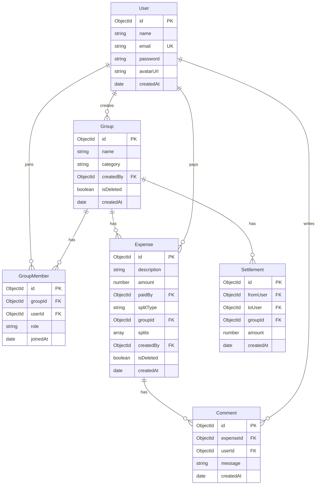

# AI_CONTEXT.md

## Product Understanding
The goal is to build and deploy a Splitwise-inspired expense sharing application (MERN stack). The application will help groups of users track shared expenses, calculate balances dynamically, view settlements, and discuss details in real-time, per-expense chat rooms.

## Splitwise Research
Splitwise is a leading expense-splitting tool. The core features we are reverse-engineering and adapting for the MVP include:
- **Groups:** Separating shared expenses by groups (e.g., flats, trips, couples).
- **Balances:** Displaying who owes whom and how much (net balances).
- **Settlements:** Tracking manual cash transactions to balance the books.
- **Terminology:** Adhering to "You owe", "You are owed", and "Settle up" UI copies.
- **Simplification of Debts:** In Splitwise, debt simplification reduces the total number of transactions. For our MVP, this is **skipped** to focus on database and API solidity.

## User Personas
1. **Flatmates:** Share rent, bills, groceries, and utilities. They need a clean way to log high-volume expenses.
2. **Travelers:** Track shared trip expenses (lodging, dining, transport).
3. **Couples/Friends:** Log casual dining, outings, and movies.

## Scope
### In Scope (MVP)
- **Authentication:** JWT-based register, login, logout, and protected routes.
- **Groups:** Create Group, Invite/Add Members (by email, must be registered), Remove Members, View Group Members. Enforce a lightweight "creator/admin" role. Soft-delete groups (only when outstanding balances are zero).
- **Expenses:** Log, Edit, and Soft-delete expenses. Supports equal, unequal, percentage, and share-based splits.
- **Balances:** Dynamically calculated net pairwise balances and overall balances per group.
- **Settlements:** Record partial and full manual cash payments. Immediate balance updates.
- **Expense Chat:** Real-time, persistent comments tied to individual expenses using Socket.io rooms.
- **Dashboard:** Display total balance, recent activity, group lists, and balance summaries.

### Out of Scope
- Debt simplification algorithm.
- Multi-currency support (single hardcoded currency, INR/₹).
- OCR receipt scanning.
- Recurring/scheduled expenses.
- Real-world payment gateways (e.g., Stripe, PayPal, UPI).
- Exporting data (CSV/PDF).
- Global activity log (only group-level activity is retained).
- Email verification and password resets.
- Global push/toast notifications (WebSocket limited to active expense rooms).

## Requirements

### Functional Requirements
1. **User Auth:** Safe registration with hashed passwords (Bcrypt) and session JWT.
2. **Group Management:** Only the group creator can edit the group name/category, remove members, or delete the group.
3. **Leave Group:** Block a member from leaving if they have a non-zero balance.
4. **Group Deletion:** Soft delete (`deletedAt` or `isDeleted` flag). Only allowed if all members have zero outstanding balance.
5. **Expense Management:** Only the expense creator or group admin can edit or delete an expense. Deletion is a soft delete.
6. **Split Types Validation:**
   - **Equal:** Divide total amount equally.
   - **Unequal:** Sum of splits must equal total amount.
   - **Percentage:** Sum of percentages must equal 100%.
   - **Shares:** Split is ratio-based (shares / total_shares).
7. **Dynamic Balances:** Balances are NOT stored. They must be calculated dynamically via database aggregations of expenses and settlements.
8. **Real-time Chat:** Persistent comments in a database table/collection. Socket.io joins expense-specific rooms.

### Non-Functional Requirements
1. **Aesthetics:** Tangerine & Charcoal palette. High-contrast, professional design. Flat elements (no gradients, no drop shadows). No rounded corners (`rounded-none`). 1px solid borders for separation.
2. **Security:** JWT in LocalStorage (tradeoff documented), bcrypt password hashing, and input validation on all API endpoints.
3. **Scalability:** Optimized MongoDB queries with indexes.
4. **Data Integrity:** Soft deletes to avoid cascade orphans.

## User Flows
1. **Registration/Login:** User signs up or logs in -> receives JWT -> redirected to Dashboard.
2. **Create Group:** User inputs name and selects category (Home, Trip, Couple, Other) -> Group created with user as creator -> User added as first member.
3. **Add Members:** User inputs email -> System checks if email exists -> Adds user to `GroupMembers` join table -> Real-time update.
4. **Add Expense:** User fills description, amount, split type, and participants -> API validates splits -> Expense saved -> Dynamic balance updates.
5. **Settle Up:** From Group Detail page, click Settle Up -> select counterparty and amount -> record settlement -> dynamic balance updates.
6. **Expense Chat:** Click on an expense -> joins Socket room -> displays comments -> user posts comment -> saved to DB and broadcast to room.

## Database Design
We use MongoDB Atlas with Mongoose.

## Collection Schemas

### Users (`users`)
- `_id`: ObjectId
- `name`: String, required
- `email`: String, required, unique, lowercase, indexed
- `password`: String, required (hashed via bcrypt)
- `avatarUrl`: String, optional
- `createdAt`: Date
- `updatedAt`: Date

### Groups (`groups`)
- `_id`: ObjectId
- `name`: String, required
- `category`: String (Enum: 'Home', 'Trip', 'Couple', 'Other'), default 'Other'
- `createdBy`: ObjectId (ref: 'User'), required
- `isDeleted`: Boolean, default false, indexed
- `createdAt`: Date
- `updatedAt`: Date

### Group Members (`groupmembers`)
- `_id`: ObjectId
- `groupId`: ObjectId (ref: 'Group'), required, indexed
- `userId`: ObjectId (ref: 'User'), required, indexed
- `role`: String (Enum: 'creator', 'member'), default 'member'
- `joinedAt`: Date, default Date.now
*Compound Index:* `{ groupId: 1, userId: 1 }` (unique constraint)

### Expenses (`expenses`)
- `_id`: ObjectId
- `description`: String, required
- `amount`: Number, required (stored in subunits/decimals, default INR)
- `paidBy`: ObjectId (ref: 'User'), required
- `splitType`: String (Enum: 'equal', 'unequal', 'percentage', 'shares'), default 'equal'
- `groupId`: ObjectId (ref: 'Group'), required, indexed
- `splits`: Array of Subdocuments:
  - `user`: ObjectId (ref: 'User'), required
  - `amount`: Number, required (calculated share)
- `createdBy`: ObjectId (ref: 'User'), required
- `isDeleted`: Boolean, default false, indexed
- `createdAt`: Date
- `updatedAt`: Date

### Settlements (`settlements`)
- `_id`: ObjectId
- `fromUser`: ObjectId (ref: 'User'), required
- `toUser`: ObjectId (ref: 'User'), required
- `groupId`: ObjectId (ref: 'Group'), required, indexed
- `amount`: Number, required
- `createdAt`: Date
- `updatedAt`: Date

### Comments (`comments`)
- `_id`: ObjectId
- `expenseId`: ObjectId (ref: 'Expense'), required, indexed
- `userId`: ObjectId (ref: 'User'), required
- `message`: String, required
- `createdAt`: Date
- `updatedAt`: Date

## API Design

### Authentication Routes
- `POST /api/auth/register` - Register a new user. Returns user details + token.
- `POST /api/auth/login` - Login. Returns user details + token.
- `GET /api/auth/me` - Get current logged-in user profile details (protected).

### Group Routes
- `POST /api/groups` - Create a new group.
- `GET /api/groups` - Get list of active groups the user belongs to.
- `GET /api/groups/:groupId` - Get group details, list of members, and expenses.
- `POST /api/groups/:groupId/members` - Add a member to a group by email (admin/creator permission optional, standard user allowed as per rules).
- `DELETE /api/groups/:groupId/members/:userId` - Remove a member (admin/creator only).
- `DELETE /api/groups/:groupId` - Soft-delete a group (admin/creator only, must have zero outstanding balances).
- `POST /api/groups/:groupId/leave` - Leave a group (must have zero balance).

### Expense Routes
- `POST /api/expenses` - Create an expense (validates split amounts).
- `PUT /api/expenses/:expenseId` - Edit an expense (creator or group admin only).
- `DELETE /api/expenses/:expenseId` - Soft-delete an expense (creator or group admin only).

### Balance & Settlement Routes
- `GET /api/groups/:groupId/balances` - Calculate and fetch the net pairwise balances for a group.
- `POST /api/settlements` - Record a manual cash payment between two users.
- `GET /api/groups/:groupId/settlements` - Fetch settlement logs for a group.

### Comment Routes
- `GET /api/expenses/:expenseId/comments` - Get comments for an expense.
- `POST /api/expenses/:expenseId/comments` - Create a comment for an expense.

## Frontend Architecture
- **Framework:** React + Vite.
- **Routing:** React Router DOM (v6).
- **Styling:** Tailwind CSS (configured for flat, sharp-cornered aesthetics).
- **HTTP Client:** Axios.
- **Real-time Client:** Socket.io Client.
- **State Management:** Auth Context (`AuthContext.js`) for logged-in user state. Local page states using `useState`.

## Backend Architecture
- **Framework:** Node.js + Express.js.
- **Database Access:** Mongoose ODM.
- **Authentication:** JWT (JSON Web Tokens) sent in Request headers.
- **Password Hashing:** Bcrypt.
- **Real-time Communication:** Socket.io.
- **Validation:** Joi.
- **Architecture Pattern:** MVC (Models, Controllers, Routes, Middlewares).

## Authentication Design
- Password hashed with Salt Rounds = 10 using `bcrypt`.
- JWT sign payload contains `{ userId: user._id }`.
- Token expires in 7 days.
- Authentication Middleware: Checks `Authorization` header for `Bearer <token>`, decodes it, fetches the user, and attaches it to `req.user`.

## Real-Time Communication Design
- **Socket Server:** Mounted on the Express HTTP server.
- **Events:**
  - `join_expense` (room: `expense_{expenseId}`)
  - `leave_expense` (room: `expense_{expenseId}`)
  - `send_comment` (save to database and emit to room)
  - `receive_comment` (client listener)
  - `typing` / `stop_typing` (real-time indicator broadcast)

## Balance Calculation Logic
Dynamic balance queries will run in MongoDB using the Aggregation pipeline:
1. **Total Paid:** Sum up all expenses where `paidBy === userId`.
2. **Total Owed:** Sum up all splits where `splits.user === userId`.
3. **Settlements Paid:** Sum up all settlements where `fromUser === userId`.
4. **Settlements Received:** Sum up all settlements where `toUser === userId`.
5. **Formula:**
   `Net Balance = (Total Paid - Total Owed) + (Settlements Paid - Settlements Received)`
6. **Pairwise calculations:** Aggregation groups splits and settlements by pairs `(User A, User B)` to determine exactly who owes whom.

## Settlement Logic
- Recording a settlement creates a record in the `settlements` collection:
  `{ fromUser, toUser, groupId, amount }`.
- Because balances are dynamically aggregated, this settlement immediately offset the owed splits between `fromUser` and `toUser` inside the balance aggregation query. No additional table updates are required.

## Deployment Plan
- **Database:** MongoDB Atlas (M0 Free Tier).
- **Backend:** Render (Web Service, free tier).
- **Frontend:** Vercel (free tier).
- **Automatic Deployment:** Triggered via Git push.

## Testing Plan
- **Manual Verification:** Postman collections for Auth, Group, Expense, and Settlement APIs.
- **Frontend Verification:** Browser-based testing of user registration, group creation, member additions, expense splitting, and chat broadcasts.

## Tradeoffs
- **LocalStorage vs. HTTP-only Cookie:** LocalStorage is selected to avoid cross-origin SameSite configuration issues on Render/Vercel free domains. Tradeoff: XSS vulnerability.
- **Dynamic Balances vs. Cached Balances:** Dynamic queries ensure consistency and eliminate out-of-sync bugs, but will scale poorly with millions of transactions. Tradeoff accepted for MVP scope.
- **Single Currency:** Hardcoded to INR (₹) to avoid real-time exchange rates integration complexity.

## Risks
- **Render Cold Start:** Render free tier spins down after 15 minutes of inactivity. First load on the app might take up to 50 seconds.
- **Socket.io connection drops:** Handled via client-side automatic reconnection.

## Known Limitations
- No multi-currency support.
- No automated debt simplification.
- No push notification system.
- No receipt scanning.
- No expense modification history/audit logs.

## AI Collaboration Log
- **2026-06-12:** Interview completed, MVP requirements finalized, AI_CONTEXT.md drafted.

## Prompt History
- Initial Prompt: Setup and request for Product Manager interview.

## Change History
- v1.0.0: Initial specifications created.
